#  NoSQL-Based Real-Time Social Media Engagement & Influence Analysis

This project simulates a real-world social media platform using a NoSQL document-oriented dataset `(MongoDB-style JSON)`.

- `User behavior (e.g., who posts, who engages, who follows)`

- `Content trends (e.g., hashtags, locations, post time)`

- `Influence and network structure (e.g., mutual follows, centrality)`

- `Emotional tone (e.g., comment sentiment, engagement impact)`

**showcasing the ability to:**

- `Handle semi-structured, nested data`

- `Perform exploratory data analysis (EDA)`

- `Create insightful visualizations`

- `Apply network theory & sentiment analysis`

- `Communicate clear data-driven recommendations`

---

## ❓ Analytical Questions to Explore

**👤 User Behavior:**

- `Who are the top 10 most followed users?`

- `Which users post the most content?`

- `Who likes and comments the most?`

- `What is the average follower-to-following ratio?`

- `How many users are inactive (no posts or comments)?`

**💬 Engagement & Virality:**

- `What are the most liked and commented posts?`

- `Which posts are the most viral (likes + 2×comments)?`

- `Which users have the highest average engagement per post?`

- `What is the distribution of likes and comments across all posts?`

**🏷️ Hashtag & Location Insights:**

- `What are the top 10 most used hashtags?`

- `Which hashtags generate the highest engagement?`

- `What are the most active locations for posting?`

**⏰ Temporal Patterns:**

- `What times of day and days of week have the most posts?`

- `Are there peak hours for high engagement?`

- `Does sentiment or engagement change based on post time?`

**📡 Network Structure & Influence:**

- `What does the user-follow network look like?`

- `Who are the most influential users (followers + engagement)?`

- `How many users follow each other back (mutual follows)?`

- `Are users with more followers more active or more liked?`

**🧠 Sentiment & NLP:**

- `What is the overall sentiment of user comments?`

- `Which posts receive the most positive or negative sentiment?`

- `Are more emotional comments linked to higher engagement?`

- `Which users post mostly negative or mostly positive content?`

---

## Project Folder Structure
```
social-pulse-nosql/
│
├── data/
│   ├── users.json              # Raw user profile data (NoSQL-style)
│   ├── posts.json              # Raw post + engagement data
│  
│
├── notebooks/
│   └── social_pulse_analysis.ipynb  # Main Jupyter notebook for EDA, network, sentiment
│
├── visuals/
│   ├── top_hashtags.png
│   ├── post_activity_by_hour.png
│   ├── sentiment_distribution.png
│   ├── influencer_network_graph.png
│   ├── likes_vs_comments_bubble.png
│   └── ... (more generated charts)
│
├── queries/
│   └── mongodb_queries.md      # Optional: Raw MongoDB aggregation queries (if used)
│
│
├── README.md                   # Project overview, questions, visuals, conclusions
├── requirements.txt            # Python packages used (TextBlob, Pandas, Seaborn, etc.)
├── LICENSE                     # Optional license file for public sharing
└── .gitignore                  # To exclude unwanted files like .ipynb_checkpoints/
```
---

## 📦 Data Loading and Structure

### 🔹 Previewing the Datasets

#### Users Data:

|  | id | username | email | bio | profile\_pic | followers | following | created\_at |
| :--- | :--- | :--- | :--- | :--- | :--- | :--- | :--- | :--- |
| 0 | user\_1 | Urban91 | Cory\_Schoen8@gmail.com | Minimalist lifestyle advocate. | https://cdn.jsdelivr.net/gh/faker-js/assets-person-portrait/female/512/58.jpg | \['user\_12', 'user\_42', 'user\_71', 'user\_72', 'user\_100', 'user\_173', 'user\_187', 'user\_277', 'user\_280', 'user\_328', 'user\_352', 'user\_452', 'user\_473', 'user\_515', 'user\_603', 'user\_964'\] | \['user\_803', 'user\_624', 'user\_883', 'user\_253', 'user\_694', 'user\_726', 'user\_176', 'user\_499', 'user\_325', 'user\_254', 'user\_86', 'user\_851', 'user\_864', 'user\_53', 'user\_75', 'user\_124', 'user\_408', 'user\_527', 'user\_969', 'user\_440', 'user\_804', 'user\_493'\] | 2025-01-20 06:33:34.364000+00:00 |
| 1 | user\_2 | Thomas\_Blick | Jasper.Senger@hotmail.com | Building dreams in code and pixels. | https://avatars.githubusercontent.com/u/31432577 | \['user\_79', 'user\_121', 'user\_153', 'user\_165', 'user\_202', 'user\_209', 'user\_233', 'user\_317', 'user\_327', 'user\_377', 'user\_428', 'user\_614', 'user\_649', 'user\_706', 'user\_743', 'user\_782', 'user\_827', 'user\_848', 'user\_925', 'user\_939', 'user\_952'\] | \['user\_281', 'user\_9', 'user\_457', 'user\_623', 'user\_832', 'user\_60', 'user\_366', 'user\_228', 'user\_848', 'user\_524', 'user\_878', 'user\_785', 'user\_710', 'user\_135', 'user\_287', 'user\_357', 'user\_298', 'user\_830', 'user\_676', 'user\_316', 'user\_451', 'user\_853', 'user\_717'\] | 2025-02-28 02:29:52.993000+00:00 |
| 2 | user\_3 | Enrico53 | Cydney.Crist52@gmail.com | Making memories around the world. | https://cdn.jsdelivr.net/gh/faker-js/assets-person-portrait/female/512/18.jpg | \['user\_50', 'user\_76', 'user\_131', 'user\_168', 'user\_186', 'user\_216', 'user\_217', 'user\_228', 'user\_257', 'user\_350', 'user\_425', 'user\_470', 'user\_524', 'user\_622', 'user\_681', 'user\_699', 'user\_706', 'user\_718', 'user\_764', 'user\_773', 'user\_791', 'user\_897', 'user\_902', 'user\_951', 'user\_994'\] | \['user\_872', 'user\_629', 'user\_743', 'user\_986', 'user\_433', 'user\_875', 'user\_981', 'user\_843', 'user\_906', 'user\_148', 'user\_777', 'user\_572', 'user\_519', 'user\_605'\] | 2024-07-01 17:31:28.728000+00:00 |
| 3 | user\_4 | Brent\_Hermann33 | Vivian.Skiles@gmail.com | Travel. Capture. Repeat. | https://cdn.jsdelivr.net/gh/faker-js/assets-person-portrait/male/512/62.jpg | \['user\_49', 'user\_152', 'user\_181', 'user\_231', 'user\_259', 'user\_284', 'user\_347', 'user\_592', 'user\_685', 'user\_720', 'user\_725', 'user\_753', 'user\_757', 'user\_794', 'user\_821', 'user\_915', 'user\_955', 'user\_962', 'user\_988'\] | \['user\_255', 'user\_970', 'user\_48', 'user\_614', 'user\_440', 'user\_846', 'user\_119', 'user\_398', 'user\_100', 'user\_977', 'user\_217', 'user\_466', 'user\_296', 'user\_344', 'user\_341', 'user\_975', 'user\_417', 'user\_180', 'user\_260', 'user\_724', 'user\_176', 'user\_650', 'user\_870', 'user\_23', 'user\_631', 'user\_444', 'user\_938', 'user\_223'\] | 2024-08-02 05:28:50.654000+00:00 |
| 4 | user\_5 | Helena\_Stroman | Luz\_Durgan@yahoo.com | Just a human trying to do better. | https://cdn.jsdelivr.net/gh/faker-js/assets-person-portrait/male/512/79.jpg | \['user\_43', 'user\_68', 'user\_129', 'user\_137', 'user\_160', 'user\_168', 'user\_180', 'user\_223', 'user\_317', 'user\_330', 'user\_406', 'user\_407', 'user\_415', 'user\_482', 'user\_623', 'user\_692', 'user\_753', 'user\_757', 'user\_825', 'user\_876', 'user\_920', 'user\_949', 'user\_973'\] | \['user\_327', 'user\_145', 'user\_755', 'user\_467', 'user\_569', 'user\_133', 'user\_45', 'user\_825', 'user\_331', 'user\_638', 'user\_518', 'user\_746', 'user\_31', 'user\_343', 'user\_403', 'user\_537', 'user\_864', 'user\_897', 'user\_654', 'user\_47', 'user\_132', 'user\_593', 'user\_209', 'user\_351', 'user\_566', 'user\_279', 'user\_914', 'user\_775'\] | 2024-11-11 15:17:49.121000+00:00 |

#### Posts Data:
|  | id | author\_id | text | media\_url | hashtags | location | likes | comments | timestamp |
| :--- | :--- | :--- | :--- | :--- | :--- | :--- | :--- | :--- | :--- |
| 0 | post\_1 | user\_87 | Nothing like fresh air and good company. | https://loremflickr.com/2812/1773?lock=8797535974126174 | \['succedo', 'accendo'\] | Toyworth | \['user\_786', 'user\_994', 'user\_686', 'user\_601', 'user\_345', 'user\_391', 'user\_134', 'user\_840', 'user\_164', 'user\_990', 'user\_14', 'user\_401', 'user\_770', 'user\_59', 'user\_176'\] | \[{'user\_id': 'user\_217', 'text': 'Too pretty to be real.', 'timestamp': '2025-05-07T05:14:49.963Z'}, {'user\_id': 'user\_606', 'text': 'You’ve got the golden touch!', 'timestamp': '2025-05-07T06:27:43.890Z'}, {'user\_id': 'user\_254', 'text': "Can't stop looking at this!", 'timestamp': '2025-05-07T19:31:27.908Z'}, {'user\_id': 'user\_977', 'text': 'So peaceful ❤️', 'timestamp': '2025-05-08T03:17:24.961Z'}, {'user\_id': 'user\_587', 'text': 'This is pure art 🔥', 'timestamp': '2025-05-07T23:22:58.241Z'}, {'user\_id': 'user\_614', 'text': 'Your content keeps getting better!', 'timestamp': '2025-05-07T05:56:18.667Z'}, {'user\_id': 'user\_334', 'text': 'Incredible shot!', 'timestamp': '2025-05-07T20:49:45.483Z'}\] | 2025-05-07 14:48:04.341000+00:00 |
| 1 | post\_2 | user\_116 | Nothing like fresh air and good company. | https://loremflickr.com/1604/1497?lock=1094063965900491 | \['stultus', 'asperiores'\] | East Barrettworth | \['user\_896'\] | \[{'user\_id': 'user\_119', 'text': 'Your aesthetic is flawless.', 'timestamp': '2025-05-07T06:40:46.817Z'}, {'user\_id': 'user\_439', 'text': 'You have such an eye for beauty.', 'timestamp': '2025-05-07T13:12:24.039Z'}, {'user\_id': 'user\_726', 'text': 'Where do you find inspiration like this?', 'timestamp': '2025-05-08T00:27:42.081Z'}\] | 2025-05-07 21:43:21.441000+00:00 |
| 2 | post\_3 | user\_524 | Sunsets like these remind me to slow down 🌅 | https://loremflickr.com/270/44?lock=8938873091666057 | \['contra', 'trepide', 'considero'\] | Auburn | \['user\_893', 'user\_527', 'user\_391', 'user\_918', 'user\_926'\] | \[{'user\_id': 'user\_150', 'text': 'This just made my day 😊', 'timestamp': '2025-05-07T15:04:38.521Z'}, {'user\_id': 'user\_611', 'text': 'Is this edited or real?', 'timestamp': '2025-05-07T13:19:12.877Z'}, {'user\_id': 'user\_927', 'text': 'Loving the composition!', 'timestamp': '2025-05-07T20:04:25.826Z'}, {'user\_id': 'user\_396', 'text': 'Insanely beautiful!', 'timestamp': '2025-05-07T17:31:42.214Z'}, {'user\_id': 'user\_700', 'text': 'Feels like a dream 🌙', 'timestamp': '2025-05-07T06:33:22.404Z'}, {'user\_id': 'user\_381', 'text': 'Looks like something out of a fairytale.', 'timestamp': '2025-05-07T15:02:44.354Z'}, {'user\_id': 'user\_64', 'text': 'This made me smile 😊', 'timestamp': '2025-05-07T19:35:26.054Z'}\] | 2025-05-07 22:38:02.406000+00:00 |
| 3 | post\_4 | user\_980 | New recipe turned out better than expected 👨‍🍳🍝 | https://picsum.photos/seed/sdoQlp2wg/2864/1617 | \['canto'\] | Lake Jeanne | \['user\_400', 'user\_959', 'user\_593', 'user\_422', 'user\_987', 'user\_857', 'user\_657', 'user\_829', 'user\_365', 'user\_569', 'user\_858', 'user\_112', 'user\_95'\] | \[{'user\_id': 'user\_541', 'text': 'Take me there now 😭', 'timestamp': '2025-05-07T16:35:01.756Z'}, {'user\_id': 'user\_195', 'text': 'You have such an eye for beauty.', 'timestamp': '2025-05-07T21:14:56.807Z'}, {'user\_id': 'user\_195', 'text': 'The colors are so rich!', 'timestamp': '2025-05-08T00:07:47.467Z'}, {'user\_id': 'user\_563', 'text': "Can't believe this is real.", 'timestamp': '2025-05-07T05:19:11.620Z'}, {'user\_id': 'user\_626', 'text': 'It’s giving peace 🕊️', 'timestamp': '2025-05-07T14:36:15.056Z'}, {'user\_id': 'user\_383', 'text': 'Such calming energy.', 'timestamp': '2025-05-08T03:13:41.829Z'}, {'user\_id': 'user\_398', 'text': 'This photo tells a story.', 'timestamp': '2025-05-08T01:10:40.284Z'}, {'user\_id': 'user\_592', 'text': 'Frame this!', 'timestamp': '2025-05-07T18:33:34.106Z'}\] | 2025-05-07 12:57:12.284000+00:00 |
| 4 | post\_5 | user\_761 | Simple moments are the most special. | https://picsum.photos/seed/oCcp4/2210/2847 | \['nemo'\] | Stokesmouth | \['user\_199', 'user\_642', 'user\_184', 'user\_593', 'user\_165', 'user\_599', 'user\_794', 'user\_939', 'user\_704', 'user\_198', 'user\_515', 'user\_278', 'user\_973', 'user\_804', 'user\_615', 'user\_32', 'user\_571'\] | \[{'user\_id': 'user\_17', 'text': 'Pinned to my inspiration board.', 'timestamp': '2025-05-07T18:50:28.369Z'}, {'user\_id': 'user\_529', 'text': 'Too pretty to be real.', 'timestamp': '2025-05-07T11:09:08.065Z'}, {'user\_id': 'user\_222', 'text': 'Such powerful vibes.', 'timestamp': '2025-05-07T15:53:51.169Z'}, {'user\_id': 'user\_347', 'text': 'Just wow. Every time.', 'timestamp': '2025-05-07T16:56:38.989Z'}, {'user\_id': 'user\_417', 'text': 'This is why I follow you.', 'timestamp': '2025-05-08T02:31:24.004Z'}, {'user\_id': 'user\_719', 'text': 'This just made my day 😊', 'timestamp': '2025-05-07T22:36:37.500Z'}, {'user\_id': 'user\_775', 'text': 'Pure magic!', 'timestamp': '2025-05-07T09:52:56.911Z'}, {'user\_id': 'user\_313', 'text': 'Unmatched quality!', 'timestamp': '2025-05-07T19:20:52.068Z'}, {'user\_id': 'user\_988', 'text': 'Chasing sunsets like this.', 'timestamp': '2025-05-07T08:58:03.171Z'}, {'user\_id': 'user\_388', 'text': 'That’s some pro-level stuff!', 'timestamp': '2025-05-07T17:12:12.291Z'}\] | 2025-05-07 12:23:51.352000+00:00 |

#### Inspect Nested Fields

|  | likes | comments | hashtags |
| :--- | :--- | :--- | :--- |
| 0 | \['user\_786', 'user\_994', 'user\_686', 'user\_601', 'user\_345', 'user\_391', 'user\_134', 'user\_840', 'user\_164', 'user\_990', 'user\_14', 'user\_401', 'user\_770', 'user\_59', 'user\_176'\] | \[{'user\_id': 'user\_217', 'text': 'Too pretty to be real.', 'timestamp': '2025-05-07T05:14:49.963Z'}, {'user\_id': 'user\_606', 'text': 'You’ve got the golden touch!', 'timestamp': '2025-05-07T06:27:43.890Z'}, {'user\_id': 'user\_254', 'text': "Can't stop looking at this!", 'timestamp': '2025-05-07T19:31:27.908Z'}, {'user\_id': 'user\_977', 'text': 'So peaceful ❤️', 'timestamp': '2025-05-08T03:17:24.961Z'}, {'user\_id': 'user\_587', 'text': 'This is pure art 🔥', 'timestamp': '2025-05-07T23:22:58.241Z'}, {'user\_id': 'user\_614', 'text': 'Your content keeps getting better!', 'timestamp': '2025-05-07T05:56:18.667Z'}, {'user\_id': 'user\_334', 'text': 'Incredible shot!', 'timestamp': '2025-05-07T20:49:45.483Z'}\] | \['succedo', 'accendo'\] |
| 1 | \['user\_896'\] | \[{'user\_id': 'user\_119', 'text': 'Your aesthetic is flawless.', 'timestamp': '2025-05-07T06:40:46.817Z'}, {'user\_id': 'user\_439', 'text': 'You have such an eye for beauty.', 'timestamp': '2025-05-07T13:12:24.039Z'}, {'user\_id': 'user\_726', 'text': 'Where do you find inspiration like this?', 'timestamp': '2025-05-08T00:27:42.081Z'}\] | \['stultus', 'asperiores'\] |
| 2 | \['user\_893', 'user\_527', 'user\_391', 'user\_918', 'user\_926'\] | \[{'user\_id': 'user\_150', 'text': 'This just made my day 😊', 'timestamp': '2025-05-07T15:04:38.521Z'}, {'user\_id': 'user\_611', 'text': 'Is this edited or real?', 'timestamp': '2025-05-07T13:19:12.877Z'}, {'user\_id': 'user\_927', 'text': 'Loving the composition!', 'timestamp': '2025-05-07T20:04:25.826Z'}, {'user\_id': 'user\_396', 'text': 'Insanely beautiful!', 'timestamp': '2025-05-07T17:31:42.214Z'}, {'user\_id': 'user\_700', 'text': 'Feels like a dream 🌙', 'timestamp': '2025-05-07T06:33:22.404Z'}, {'user\_id': 'user\_381', 'text': 'Looks like something out of a fairytale.', 'timestamp': '2025-05-07T15:02:44.354Z'}, {'user\_id': 'user\_64', 'text': 'This made me smile 😊', 'timestamp': '2025-05-07T19:35:26.054Z'}\] | \['contra', 'trepide', 'considero'\] |


## 📊 Exploratory Data Analysis (EDA) & Analytical Questions

🎯 **Objective**:

In this section, we will:

- `Explore user activity, engagement, and content performance`

- `Understand patterns in likes, comments, followers, and hashtags`

- `Begin answering the core questions defined for the project`

### 🔍 **Q1.** Who are the top 10 most followed users?
|  | username | followers\_count |
| :--- | :--- | :--- |
| 256 | Travon62 | 31 |
| 369 | Georgiana.Predovic66 | 31 |
| 395 | Kelvin75 | 29 |
| 768 | Noah\_Lowe | 29 |
| 314 | Jermain.Bailey93 | 29 |
| 333 | Casimer.Leuschke34 | 28 |
| 932 | Sally.Schneider | 28 |
| 876 | Zachery.Miller15 | 28 |
| 458 | Fanny10 | 28 |
| 732 | Geoffrey\_Predovic72 | 28 |

### 🔍 **Q2.** Which users posted the most content?
|  | username | post\_count |
| :--- | :--- | :--- |
| 0 | Dale38 | 10 |
| 1 | Lilla88 | 10 |
| 2 | Domenica61 | 9 |
| 3 | Rolando\_Jast | 9 |
| 4 | Kasandra43 | 9 |
| 5 | Marshall50 | 9 |
| 6 | Dominique64 | 9 |
| 7 | Ramona64 | 9 |
| 8 | Mavis59 | 9 |
| 9 | Dixie42 | 9 |

### 🔍 **Q3.** What are the top 10 most used hashtags?
| <br/>hashtags | count<br/> |
| :--- | :--- |
| amor | 19 |
| consuasor | 15 |
| videlicet | 14 |
| aetas | 14 |
| ver | 14 |
| cruciamentum | 13 |
| ascit | 13 |
| confugo | 13 |
| sui | 13 |
| crinis | 13 |

### 🔍 **Q4.** What is the average number of likes and comments per post?
- `Average Likes per Post: 10.08`
- `Average Comments per Post: 4.93`


### 🔍 **Q5.** Which posts are the most viral (likes + 2×comments)?
|  | author\_id | text | num\_likes | num\_comments | engagement\_score |
| :--- | :--- | :--- | :--- | :--- | :--- |
| 2555 | user\_500 | Coffee in one hand, confidence in the other ☕💪 | 20 | 10 | 40 |
| 1863 | user\_244 | Here’s to chasing dreams and catching sunsets 🌞 | 20 | 10 | 40 |
| 571 | user\_356 | What a peaceful morning walk today 🌤️ | 20 | 10 | 40 |
| 1998 | user\_692 | Rainy day reads and cozy vibes 📚☔ | 20 | 10 | 40 |
| 2537 | user\_542 | Craving days like this again 💫 | 20 | 10 | 40 |


### 🔍 **Q6.** What times of day are users most active?
| <br/>post\_hour | count<br/> |
| :--- | :--- |
| 0 | 132 |
| 1 | 121 |
| 2 | 134 |
| 3 | 129 |
| 4 | 122 |

### 🔍 **Q7.** What days of the week see the most posting?
| <br/>post\_day | count<br/> |
| :--- | :--- |
| Wednesday | 2556 |
| Thursday | 444 |


### 🔍 **Q8.** Which locations generate the most posts?
| <br/>location | count<br/> |
| :--- | :--- |
| Pueblo | 5 |
| Pharr | 4 |
| The Hammocks | 4 |
| Skokie | 4 |
| University | 3 |
| Oakland Park | 3 |
| El Cajon | 3 |
| Duluth | 3 |
| Baumbachville | 3 |
| Kirkland | 3 |


### 🔍 **Q9.** Who are the top influencers? (followers + engagement)
|  | username | followers\_count | engagement\_score | influencer\_score |
| :--- | :--- | :--- | :--- | :--- |
| 84 | Domenica61 | 15 | 242.0 | 257.0 |
| 423 | Ramona64 | 16 | 236.0 | 252.0 |
| 10 | Lilla88 | 20 | 223.0 | 243.0 |
| 941 | Mavis59 | 26 | 216.0 | 242.0 |
| 397 | Kasandra43 | 11 | 221.0 | 232.0 |
| 936 | Marshall50 | 10 | 214.0 | 224.0 |
| 477 | Dixie42 | 12 | 210.0 | 222.0 |
| 663 | Dominique64 | 11 | 190.0 | 201.0 |
| 57 | Virgie.Monahan57 | 21 | 179.0 | 200.0 |
| 892 | Nova87 | 23 | 173.0 | 196.0 |


### 🔍 **Q10.** Which hashtags generate the most engagement?
| <br/>hashtags | num\_likes<br/> | num\_comments<br/> | engagement\_score<br/> |
| :--- | :--- | :--- | :--- |
| veritas | 20.0 | 9.0 | 38.0 |
| cicuta | 19.0 | 8.0 | 35.0 |
| autus | 20.0 | 6.0 | 32.0 |
| adiuvo | 17.666666666666668 | 7.166666666666667 | 32.0 |
| curvo | 15.714285714285714 | 7.857142857142857 | 31.428571428571427 |
| vulticulus | 15.2 | 8.0 | 31.2 |
| voveo | 16.5 | 7.0 | 30.5 |
| suadeo | 14.857142857142858 | 7.714285714285714 | 30.285714285714285 |
| tantum | 16.0 | 7.0 | 30.0 |
| vulgivagus | 17.5 | 6.0 | 29.5 |

### 🔍 **Q11.** What is the average engagement based on time of day?
|  | post\_hour | engagement\_score |
| :--- | :--- | :--- |
| 0 | 0 | 19.348484848484848 |
| 1 | 1 | 18.75206611570248 |
| 2 | 2 | 19.44776119402985 |
| 3 | 3 | 19.131782945736433 |
| 4 | 4 | 19.770491803278688 |
| 5 | 5 | 18.244274809160306 |
| 6 | 6 | 20.52542372881356 |
| 7 | 7 | 21.703389830508474 |
| 8 | 8 | 20.196581196581196 |
| 9 | 9 | 19.822429906542055 |
| 10 | 10 | 19.123076923076923 |
| 11 | 11 | 20.11023622047244 |
| 12 | 12 | 20.380597014925375 |
| 13 | 13 | 19.34453781512605 |
| 14 | 14 | 21.04861111111111 |
| 15 | 15 | 20.389705882352942 |
| 16 | 16 | 21.694214876033058 |
| 17 | 17 | 19.19047619047619 |
| 18 | 18 | 19.231404958677686 |
| 19 | 19 | 20.856060606060606 |
| 20 | 20 | 19.942857142857143 |
| 21 | 21 | 20.288888888888888 |
| 22 | 22 | 20.4390243902439 |
| 23 | 23 | 19.74576271186441 |

### 🔍 **Q12.** What is the average sentiment of comments per post?
|  | sentiment |
| :--- | :--- |
| 0 | 0.225 |
| 1 | 0.375 |
| 2 | 0.0 |
| 3 | 0.25 |
| 4 | 0.21428571428571427 |
| 5 | 0.625 |
| 6 | 1.0 |
| 7 | 1.0 |
| 8 | 0.0 |
| 9 | 0.0 |

### 🔍 **Q13.** Do mutual followers tend to post more?
|  | id | username | email | bio | profile\_pic | followers | following | created\_at | followers\_count | mutual\_follows | post\_count |
| :--- | :--- | :--- | :--- | :--- | :--- | :--- | :--- | :--- | :--- | :--- | :--- |
| 0 | user\_1 | Urban91 | Cory\_Schoen8@gmail.com | Minimalist lifestyle advocate. | https://cdn.jsdelivr.net/gh/faker-js/assets-person-portrait/female/512/58.jpg | \['user\_12', 'user\_42', 'user\_71', 'user\_72', 'user\_100', 'user\_173', 'user\_187', 'user\_277', 'user\_280', 'user\_328', 'user\_352', 'user\_452', 'user\_473', 'user\_515', 'user\_603', 'user\_964'\] | \['user\_803', 'user\_624', 'user\_883', 'user\_253', 'user\_694', 'user\_726', 'user\_176', 'user\_499', 'user\_325', 'user\_254', 'user\_86', 'user\_851', 'user\_864', 'user\_53', 'user\_75', 'user\_124', 'user\_408', 'user\_527', 'user\_969', 'user\_440', 'user\_804', 'user\_493'\] | 2025-01-20 06:33:34.364000+00:00 | 16 | 0 | 2.0 |
| 1 | user\_2 | Thomas\_Blick | Jasper.Senger@hotmail.com | Building dreams in code and pixels. | https://avatars.githubusercontent.com/u/31432577 | \['user\_79', 'user\_121', 'user\_153', 'user\_165', 'user\_202', 'user\_209', 'user\_233', 'user\_317', 'user\_327', 'user\_377', 'user\_428', 'user\_614', 'user\_649', 'user\_706', 'user\_743', 'user\_782', 'user\_827', 'user\_848', 'user\_925', 'user\_939', 'user\_952'\] | \['user\_281', 'user\_9', 'user\_457', 'user\_623', 'user\_832', 'user\_60', 'user\_366', 'user\_228', 'user\_848', 'user\_524', 'user\_878', 'user\_785', 'user\_710', 'user\_135', 'user\_287', 'user\_357', 'user\_298', 'user\_830', 'user\_676', 'user\_316', 'user\_451', 'user\_853', 'user\_717'\] | 2025-02-28 02:29:52.993000+00:00 | 21 | 1 | 4.0 |
| 2 | user\_3 | Enrico53 | Cydney.Crist52@gmail.com | Making memories around the world. | https://cdn.jsdelivr.net/gh/faker-js/assets-person-portrait/female/512/18.jpg | \['user\_50', 'user\_76', 'user\_131', 'user\_168', 'user\_186', 'user\_216', 'user\_217', 'user\_228', 'user\_257', 'user\_350', 'user\_425', 'user\_470', 'user\_524', 'user\_622', 'user\_681', 'user\_699', 'user\_706', 'user\_718', 'user\_764', 'user\_773', 'user\_791', 'user\_897', 'user\_902', 'user\_951', 'user\_994'\] | \['user\_872', 'user\_629', 'user\_743', 'user\_986', 'user\_433', 'user\_875', 'user\_981', 'user\_843', 'user\_906', 'user\_148', 'user\_777', 'user\_572', 'user\_519', 'user\_605'\] | 2024-07-01 17:31:28.728000+00:00 | 25 | 0 | 5.0 |

### 🔍 **Q14.** What are the most used hashtags per day of the week?
|  | post\_day | hashtags | count |
| :--- | :--- | :--- | :--- |
| 0 | Thursday | soluta | 6 |
| 1 | Wednesday | amor | 16 |

### 🔍 **Q15.** How many users are inactive (no posts or comments)?
`Inactive users: 0 out of 1000`

### 🔍 **Q16.** Which users receive the most average engagement per post?
|  | username | avg\_engagement |
| :--- | :--- | :--- |
| 461 | Uriel\_Kerluke63 | 40.0 |
| 21 | Tanya\_Gutkowski69 | 39.0 |
| 551 | Estel\_Ankunding | 38.0 |
| 518 | Virgil43 | 38.0 |
| 455 | Daren.Bayer40 | 38.0 |
| 902 | Claudia15 | 38.0 |
| 315 | Carli\_OHara | 38.0 |
| 398 | Michelle.Hane | 38.0 |
| 638 | Mekhi.Feest | 36.0 |
| 731 | Tristian35 | 36.0 |

### 🔍 **Q17.** Are users with more followers also more active?
|  | id | username | email | bio | profile\_pic | followers | following | created\_at | followers\_count | mutual\_follows | post\_count |
| :--- | :--- | :--- | :--- | :--- | :--- | :--- | :--- | :--- | :--- | :--- | :--- |
| 0 | user\_1 | Urban91 | Cory\_Schoen8@gmail.com | Minimalist lifestyle advocate. | https://cdn.jsdelivr.net/gh/faker-js/assets-person-portrait/female/512/58.jpg | \['user\_12', 'user\_42', 'user\_71', 'user\_72', 'user\_100', 'user\_173', 'user\_187', 'user\_277', 'user\_280', 'user\_328', 'user\_352', 'user\_452', 'user\_473', 'user\_515', 'user\_603', 'user\_964'\] | \['user\_803', 'user\_624', 'user\_883', 'user\_253', 'user\_694', 'user\_726', 'user\_176', 'user\_499', 'user\_325', 'user\_254', 'user\_86', 'user\_851', 'user\_864', 'user\_53', 'user\_75', 'user\_124', 'user\_408', 'user\_527', 'user\_969', 'user\_440', 'user\_804', 'user\_493'\] | 2025-01-20 06:33:34.364000+00:00 | 16 | 0 | 2.0 |
| 1 | user\_2 | Thomas\_Blick | Jasper.Senger@hotmail.com | Building dreams in code and pixels. | https://avatars.githubusercontent.com/u/31432577 | \['user\_79', 'user\_121', 'user\_153', 'user\_165', 'user\_202', 'user\_209', 'user\_233', 'user\_317', 'user\_327', 'user\_377', 'user\_428', 'user\_614', 'user\_649', 'user\_706', 'user\_743', 'user\_782', 'user\_827', 'user\_848', 'user\_925', 'user\_939', 'user\_952'\] | \['user\_281', 'user\_9', 'user\_457', 'user\_623', 'user\_832', 'user\_60', 'user\_366', 'user\_228', 'user\_848', 'user\_524', 'user\_878', 'user\_785', 'user\_710', 'user\_135', 'user\_287', 'user\_357', 'user\_298', 'user\_830', 'user\_676', 'user\_316', 'user\_451', 'user\_853', 'user\_717'\] | 2025-02-28 02:29:52.993000+00:00 | 21 | 1 | 4.0 |
| 2 | user\_3 | Enrico53 | Cydney.Crist52@gmail.com | Making memories around the world. | https://cdn.jsdelivr.net/gh/faker-js/assets-person-portrait/female/512/18.jpg | \['user\_50', 'user\_76', 'user\_131', 'user\_168', 'user\_186', 'user\_216', 'user\_217', 'user\_228', 'user\_257', 'user\_350', 'user\_425', 'user\_470', 'user\_524', 'user\_622', 'user\_681', 'user\_699', 'user\_706', 'user\_718', 'user\_764', 'user\_773', 'user\_791', 'user\_897', 'user\_902', 'user\_951', 'user\_994'\] | \['user\_872', 'user\_629', 'user\_743', 'user\_986', 'user\_433', 'user\_875', 'user\_981', 'user\_843', 'user\_906', 'user\_148', 'user\_777', 'user\_572', 'user\_519', 'user\_605'\] | 2024-07-01 17:31:28.728000+00:00 | 25 | 0 | 5.0 |
| 3 | user\_4 | Brent\_Hermann33 | Vivian.Skiles@gmail.com | Travel. Capture. Repeat. | https://cdn.jsdelivr.net/gh/faker-js/assets-person-portrait/male/512/62.jpg | \['user\_49', 'user\_152', 'user\_181', 'user\_231', 'user\_259', 'user\_284', 'user\_347', 'user\_592', 'user\_685', 'user\_720', 'user\_725', 'user\_753', 'user\_757', 'user\_794', 'user\_821', 'user\_915', 'user\_955', 'user\_962', 'user\_988'\] | \['user\_255', 'user\_970', 'user\_48', 'user\_614', 'user\_440', 'user\_846', 'user\_119', 'user\_398', 'user\_100', 'user\_977', 'user\_217', 'user\_466', 'user\_296', 'user\_344', 'user\_341', 'user\_975', 'user\_417', 'user\_180', 'user\_260', 'user\_724', 'user\_176', 'user\_650', 'user\_870', 'user\_23', 'user\_631', 'user\_444', 'user\_938', 'user\_223'\] | 2024-08-02 05:28:50.654000+00:00 | 19 | 0 | 2.0 |
| 4 | user\_5 | Helena\_Stroman | Luz\_Durgan@yahoo.com | Just a human trying to do better. | https://cdn.jsdelivr.net/gh/faker-js/assets-person-portrait/male/512/79.jpg | \['user\_43', 'user\_68', 'user\_129', 'user\_137', 'user\_160', 'user\_168', 'user\_180', 'user\_223', 'user\_317', 'user\_330', 'user\_406', 'user\_407', 'user\_415', 'user\_482', 'user\_623', 'user\_692', 'user\_753', 'user\_757', 'user\_825', 'user\_876', 'user\_920', 'user\_949', 'user\_973'\] | \['user\_327', 'user\_145', 'user\_755', 'user\_467', 'user\_569', 'user\_133', 'user\_45', 'user\_825', 'user\_331', 'user\_638', 'user\_518', 'user\_746', 'user\_31', 'user\_343', 'user\_403', 'user\_537', 'user\_864', 'user\_897', 'user\_654', 'user\_47', 'user\_132', 'user\_593', 'user\_209', 'user\_351', 'user\_566', 'user\_279', 'user\_914', 'user\_775'\] | 2024-11-11 15:17:49.121000+00:00 | 23 | 1 | 5.0 |

### 🔍 **Q18.** What is the most common length of a post text?
- `The mean of the most common length of a post text: 39.108`
- `The median of the most common length of a post text: 39.0`

### 🔍 **Q19.** What is the correlation between hashtags used and engagement?
|  | hashtag\_count | engagement\_score |
| :--- | :--- | :--- |
| 0 | 2 | 22 |
| 1 | 2 | 4 |
| 2 | 3 | 12 |
| 3 | 1 | 21 |
| 4 | 1 | 27 |

### 🔍 **Q20.** Which users consistently post high-performing content?
|  | author\_id | post\_count | avg\_engagement |
| :--- | :--- | :--- | :--- |
| 327 | user\_417 | 3 | 26.666666666666668 |
| 555 | user\_631 | 3 | 25.666666666666668 |
| 782 | user\_845 | 3 | 25.0 |
| 634 | user\_708 | 3 | 24.666666666666668 |
| 264 | user\_356 | 3 | 24.0 |
| 440 | user\_523 | 4 | 23.0 |
| 605 | user\_680 | 3 | 22.666666666666668 |
| 410 | user\_497 | 5 | 22.6 |
| 180 | user\_275 | 3 | 22.333333333333332 |
| 224 | user\_319 | 3 | 22.333333333333332 |


## 📡 Network Graph Analysis

🎯 **Objective:**

- In this section, we’ll visualize the social network of users based on their `follow relationships`.

**By building a directed graph using NetworkX:**

- `Nodes represent users`

- `Directed edges represent a user following another user`

- `Edge direction: A ➝ B means "A follows B"`

**We will:**

- `Build a complete user graph`

- `Visualize a subgraph (e.g. top 50 users)`

- `Analyze basic network properties`

- `Optionally label influencers or highly connected users`


### 📏 Network Size and Basic Stats
- `Number of Users (Nodes): 1000`
- `Number of Follows (Edges): 17704`
- `Graph Density: 0.0177`

### 📊 Computing Network Centrality Measures
**Top Influencers by Follower Centrality:**
- `Travon62: 0.031`
- `Georgiana.Predovic66: 0.031`
- `Jermain.Bailey93: 0.029`
- `Kelvin75: 0.029`
- `Noah_Lowe: 0.029`


## 🎨 Visual Analytics

🎯 **Objective:**

- This section focuses on creating `insightful`, `polished` visualizations that highlight key trends and patterns in the social media dataset.

**We’ll visualize:**

- `User activity`

- `Posting behavior (time-based)`

- `Hashtag and location trends`

- `Engagement distribution`

- `Influencer impact`

### 📊 Posting Activity by Hour of Day

### 📅 Posting Activity by Day of Week
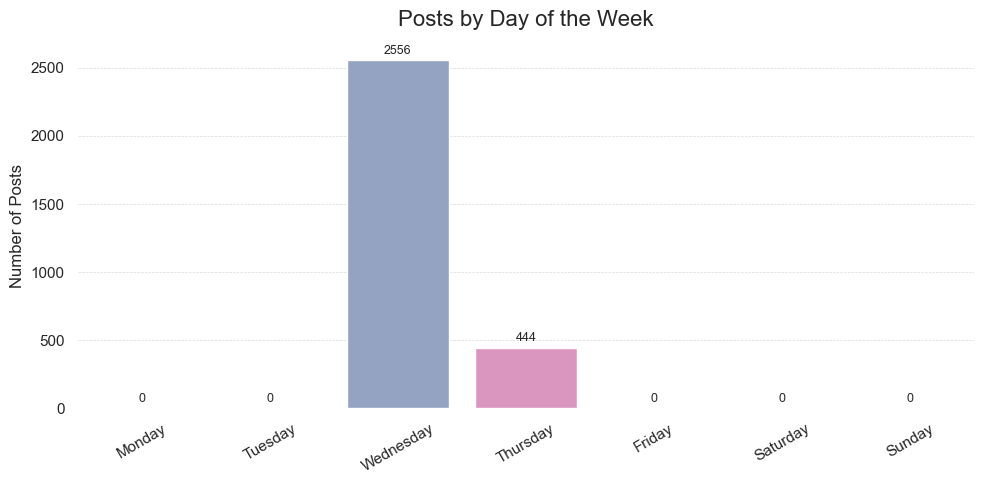
### 🏷️ Top 10 Hashtags by Frequency
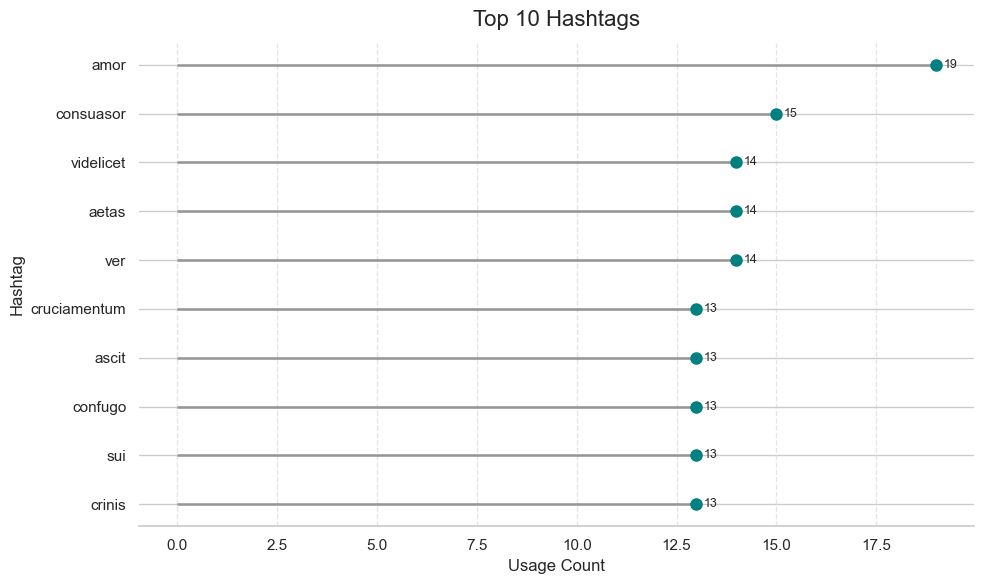
### 📍 Top Locations by Post Volume
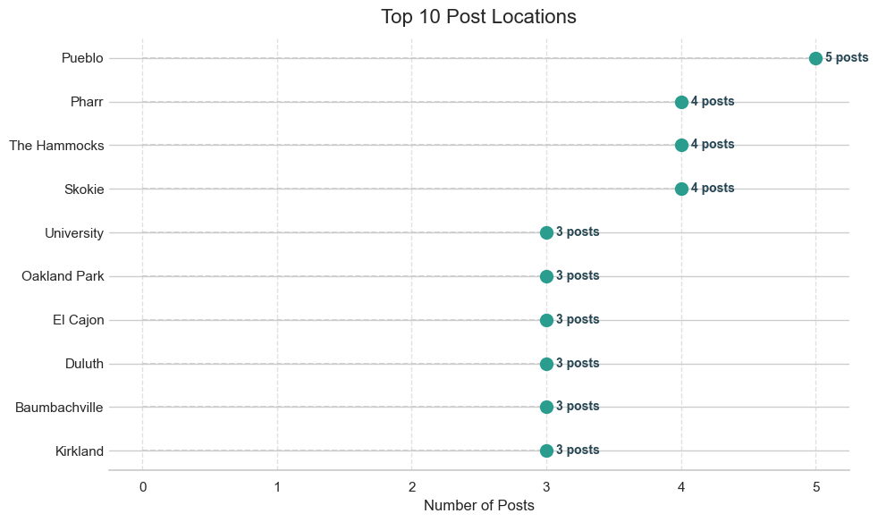
### 💥 Distribution of Likes and Comments
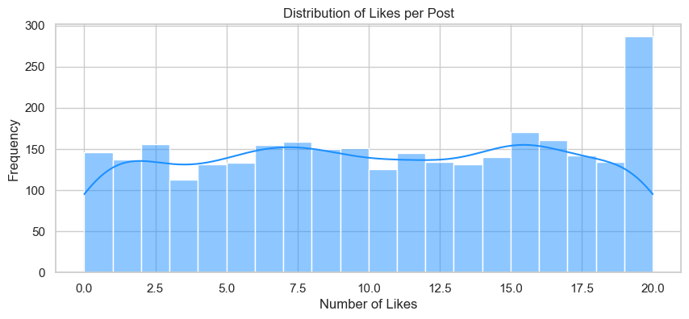
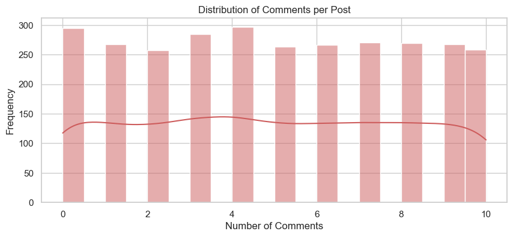
### 🌟 Influencer Impact – Followers vs Engagement
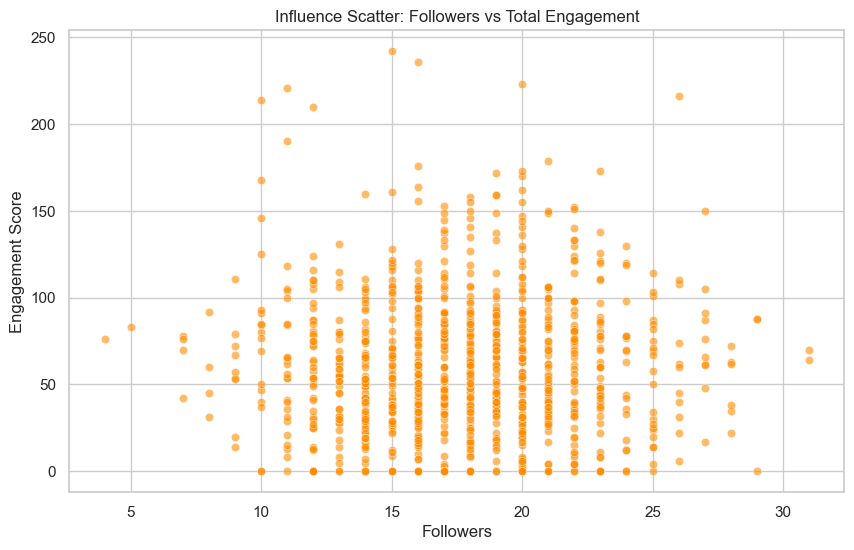
### 🧠 Correlation Heatmap of Key Metrics
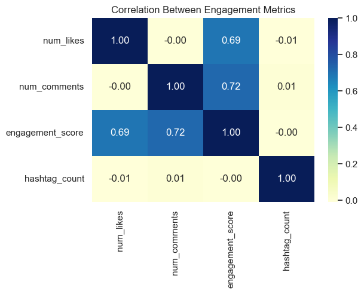
### 📐 Likes Distribution by Day of Week
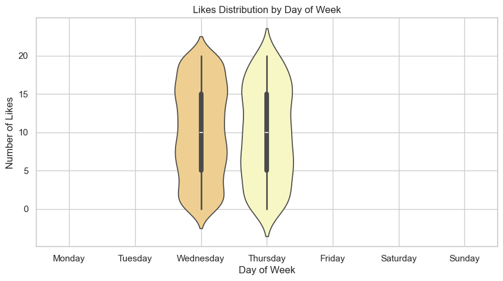
### 🌀 Hashtags vs Engagement Score
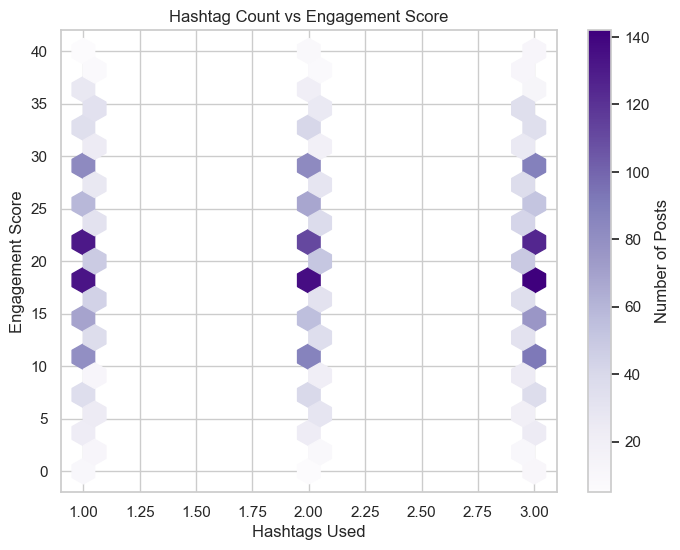
### 🧭 Post Volume by Hour (Circular Time Distribution)
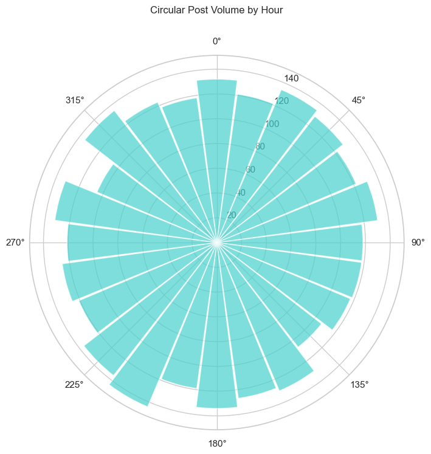
### 📚 Content Length Style
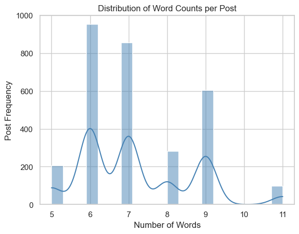
### 🎨 Likes vs Comments per Post (Bubble Plot)
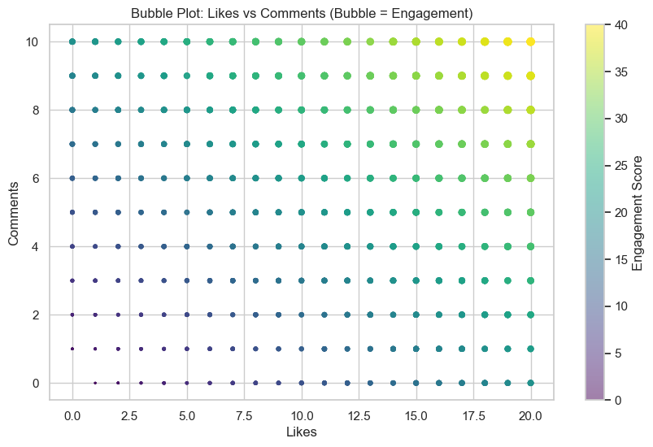
### 🧬 Multivariate Visual Insight of Posts
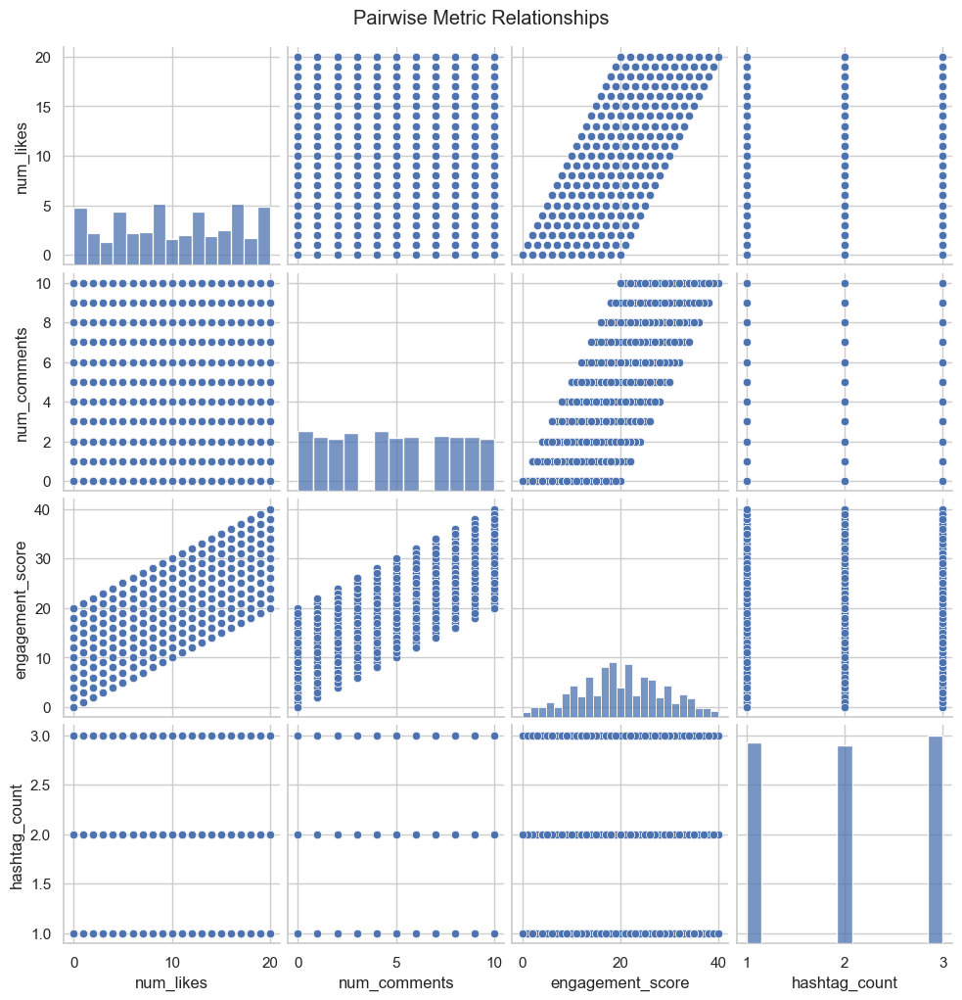

## 🧠 Sentiment Analysis on Comments
🎯 **Objective:**

**The goal is to analyze the `emotional tone` of `user comments` on posts by assigning `sentiment polarity scores`. This will helps answer questions like:**

- `Are users generally positive, neutral, or negative in their comments?`

- `Which posts receive the most positive or negative comments?`

- `Which users contribute more positive/negative sentiment?`

**We'll use `TextBlob`, a lightweight `NLP library`, to evaluate the `sentiment polarity`:**

- `-1 = very negative`

- `0 = neutral`

- `+1 = very positive`


### 🧩 Extract Comments from posts.json
|  | post\_id | post\_author\_id | comment\_user\_id | comment\_text |
| :--- | :--- | :--- | :--- | :--- |
| 0 | post\_1 | user\_87 | user\_217 | Too pretty to be real. |
| 1 | post\_1 | user\_87 | user\_606 | You’ve got the golden touch! |
| 2 | post\_1 | user\_87 | user\_254 | Can't stop looking at this! |
| 3 | post\_1 | user\_87 | user\_977 | So peaceful ❤️ |
| 4 | post\_1 | user\_87 | user\_587 | This is pure art 🔥 |

### 📉 Calculate Sentiment Polarity for Each Comment
|  | sentiment |
| :--- | :--- |
| 0 | 0.225 |
| 1 | 0.375 |
| 2 | 0.0 |
| 3 | 0.25 |
| 4 | 0.21428571428571427 |

### 🧾 Average Sentiment per Post
|  | post\_id | avg\_sentiment |
| :--- | :--- | :--- |
| 0 | post\_1 | 0.3841836734693877 |
| 1 | post\_10 | 1.0 |
| 2 | post\_100 | 0.0 |
| 3 | post\_1000 | 0.0 |
| 4 | post\_1002 | 0.0018518518518518576 |

|  | id | author\_id | text | media\_url | hashtags | location | likes | comments | timestamp | num\_likes | num\_comments | engagement\_score | post\_hour | post\_day | text\_length | hashtag\_count | word\_count | post\_id | avg\_sentiment |
| :--- | :--- | :--- | :--- | :--- | :--- | :--- | :--- | :--- | :--- | :--- | :--- | :--- | :--- | :--- | :--- | :--- | :--- | :--- | :--- |
| 0 | post\_1 | user\_87 | Nothing like fresh air and good company. | https://loremflickr.com/2812/1773?lock=8797535974126174 | \['succedo', 'accendo'\] | Toyworth | \['user\_786', 'user\_994', 'user\_686', 'user\_601', 'user\_345', 'user\_391', 'user\_134', 'user\_840', 'user\_164', 'user\_990', 'user\_14', 'user\_401', 'user\_770', 'user\_59', 'user\_176'\] | \[{'user\_id': 'user\_217', 'text': 'Too pretty to be real.', 'timestamp': '2025-05-07T05:14:49.963Z'}, {'user\_id': 'user\_606', 'text': 'You’ve got the golden touch!', 'timestamp': '2025-05-07T06:27:43.890Z'}, {'user\_id': 'user\_254', 'text': "Can't stop looking at this!", 'timestamp': '2025-05-07T19:31:27.908Z'}, {'user\_id': 'user\_977', 'text': 'So peaceful ❤️', 'timestamp': '2025-05-08T03:17:24.961Z'}, {'user\_id': 'user\_587', 'text': 'This is pure art 🔥', 'timestamp': '2025-05-07T23:22:58.241Z'}, {'user\_id': 'user\_614', 'text': 'Your content keeps getting better!', 'timestamp': '2025-05-07T05:56:18.667Z'}, {'user\_id': 'user\_334', 'text': 'Incredible shot!', 'timestamp': '2025-05-07T20:49:45.483Z'}\] | 2025-05-07 14:48:04.341000+00:00 | 15 | 7 | 22 | 14 | Wednesday | 40 | 2 | 7 | post\_1 | 0.3841836734693877 |
| 1 | post\_2 | user\_116 | Nothing like fresh air and good company. | https://loremflickr.com/1604/1497?lock=1094063965900491 | \['stultus', 'asperiores'\] | East Barrettworth | \['user\_896'\] | \[{'user\_id': 'user\_119', 'text': 'Your aesthetic is flawless.', 'timestamp': '2025-05-07T06:40:46.817Z'}, {'user\_id': 'user\_439', 'text': 'You have such an eye for beauty.', 'timestamp': '2025-05-07T13:12:24.039Z'}, {'user\_id': 'user\_726', 'text': 'Where do you find inspiration like this?', 'timestamp': '2025-05-08T00:27:42.081Z'}\] | 2025-05-07 21:43:21.441000+00:00 | 1 | 3 | 4 | 21 | Wednesday | 40 | 2 | 7 | post\_2 | 0.3333333333333333 |
| 2 | post\_3 | user\_524 | Sunsets like these remind me to slow down 🌅 | https://loremflickr.com/270/44?lock=8938873091666057 | \['contra', 'trepide', 'considero'\] | Auburn | \['user\_893', 'user\_527', 'user\_391', 'user\_918', 'user\_926'\] | \[{'user\_id': 'user\_150', 'text': 'This just made my day 😊', 'timestamp': '2025-05-07T15:04:38.521Z'}, {'user\_id': 'user\_611', 'text': 'Is this edited or real?', 'timestamp': '2025-05-07T13:19:12.877Z'}, {'user\_id': 'user\_927', 'text': 'Loving the composition!', 'timestamp': '2025-05-07T20:04:25.826Z'}, {'user\_id': 'user\_396', 'text': 'Insanely beautiful!', 'timestamp': '2025-05-07T17:31:42.214Z'}, {'user\_id': 'user\_700', 'text': 'Feels like a dream 🌙', 'timestamp': '2025-05-07T06:33:22.404Z'}, {'user\_id': 'user\_381', 'text': 'Looks like something out of a fairytale.', 'timestamp': '2025-05-07T15:02:44.354Z'}, {'user\_id': 'user\_64', 'text': 'This made me smile 😊', 'timestamp': '2025-05-07T19:35:26.054Z'}\] | 2025-05-07 22:38:02.406000+00:00 | 5 | 7 | 12 | 22 | Wednesday | 43 | 3 | 9 | post\_3 | 0.32142857142857145 |
| 3 | post\_4 | user\_980 | New recipe turned out better than expected 👨‍🍳🍝 | https://picsum.photos/seed/sdoQlp2wg/2864/1617 | \['canto'\] | Lake Jeanne | \['user\_400', 'user\_959', 'user\_593', 'user\_422', 'user\_987', 'user\_857', 'user\_657', 'user\_829', 'user\_365', 'user\_569', 'user\_858', 'user\_112', 'user\_95'\] | \[{'user\_id': 'user\_541', 'text': 'Take me there now 😭', 'timestamp': '2025-05-07T16:35:01.756Z'}, {'user\_id': 'user\_195', 'text': 'You have such an eye for beauty.', 'timestamp': '2025-05-07T21:14:56.807Z'}, {'user\_id': 'user\_195', 'text': 'The colors are so rich!', 'timestamp': '2025-05-08T00:07:47.467Z'}, {'user\_id': 'user\_563', 'text': "Can't believe this is real.", 'timestamp': '2025-05-07T05:19:11.620Z'}, {'user\_id': 'user\_626', 'text': 'It’s giving peace 🕊️', 'timestamp': '2025-05-07T14:36:15.056Z'}, {'user\_id': 'user\_383', 'text': 'Such calming energy.', 'timestamp': '2025-05-08T03:13:41.829Z'}, {'user\_id': 'user\_398', 'text': 'This photo tells a story.', 'timestamp': '2025-05-08T01:10:40.284Z'}, {'user\_id': 'user\_592', 'text': 'Frame this!', 'timestamp': '2025-05-07T18:33:34.106Z'}\] | 2025-05-07 12:57:12.284000+00:00 | 13 | 8 | 21 | 12 | Wednesday | 47 | 1 | 8 | post\_4 | 0.08359375 |
| 4 | post\_5 | user\_761 | Simple moments are the most special. | https://picsum.photos/seed/oCcp4/2210/2847 | \['nemo'\] | Stokesmouth | \['user\_199', 'user\_642', 'user\_184', 'user\_593', 'user\_165', 'user\_599', 'user\_794', 'user\_939', 'user\_704', 'user\_198', 'user\_515', 'user\_278', 'user\_973', 'user\_804', 'user\_615', 'user\_32', 'user\_571'\] | \[{'user\_id': 'user\_17', 'text': 'Pinned to my inspiration board.', 'timestamp': '2025-05-07T18:50:28.369Z'}, {'user\_id': 'user\_529', 'text': 'Too pretty to be real.', 'timestamp': '2025-05-07T11:09:08.065Z'}, {'user\_id': 'user\_222', 'text': 'Such powerful vibes.', 'timestamp': '2025-05-07T15:53:51.169Z'}, {'user\_id': 'user\_347', 'text': 'Just wow. Every time.', 'timestamp': '2025-05-07T16:56:38.989Z'}, {'user\_id': 'user\_417', 'text': 'This is why I follow you.', 'timestamp': '2025-05-08T02:31:24.004Z'}, {'user\_id': 'user\_719', 'text': 'This just made my day 😊', 'timestamp': '2025-05-07T22:36:37.500Z'}, {'user\_id': 'user\_775', 'text': 'Pure magic!', 'timestamp': '2025-05-07T09:52:56.911Z'}, {'user\_id': 'user\_313', 'text': 'Unmatched quality!', 'timestamp': '2025-05-07T19:20:52.068Z'}, {'user\_id': 'user\_988', 'text': 'Chasing sunsets like this.', 'timestamp': '2025-05-07T08:58:03.171Z'}, {'user\_id': 'user\_388', 'text': 'That’s some pro-level stuff!', 'timestamp': '2025-05-07T17:12:12.291Z'}\] | 2025-05-07 12:23:51.352000+00:00 | 17 | 10 | 27 | 12 | Wednesday | 36 | 1 | 6 | post\_5 | 0.08946428571428572 |

### 🤝‍ Average Sentiment per Commenter

| <br/>comment\_user\_id | sentiment<br/> |
| :--- | :--- |
| user\_513 | 0.475 |
| user\_580 | 0.46071428571428574 |
| user\_526 | 0.4527777777777778 |
| user\_901 | 0.4446428571428572 |
| user\_322 | 0.4423076923076923 |
| user\_783 | 0.44125 |
| user\_447 | 0.434375 |
| user\_993 | 0.4222222222222222 |
| user\_702 | 0.41911764705882354 |
| user\_653 | 0.4166666666666667 |

## 📊 Final Insights & Recommendations

### 1️⃣ Engagement Metrics: Likes, Comments, Engagement Score
**Visualizations Referenced:**

- `Likes vs Comments per Post (bar + bubble plot)`

- `Distribution of Likes per Post`

- `Distribution of Comments per Post`

- `Engagement Score vs Hashtag Count (box, hex, scatter)`

- `Pairwise Correlation Heatmap`

- `Influence Scatter (Followers vs Engagement)`

**🔍 Insights:**

- `Engagement is driven by a combination of likes and comments, not either alone.`

- `Correlation with engagement_score:`

  - `likes: 0.69`

  - `comments: 0.72`

  - `hashtag_count: ~0.0 → No impact`

  - `Posts often cap at 40 engagement score, the max in your formula.`

  - `Likes spike at 0 and 20 (edge effect), while comments are evenly distributed.`

  - `Followers ≠ Engagement: many low-follower users perform better.`

**✅ Recommendations:**

- `Use calls-to-comment in posts.`

- `Identify and amplify engagement-efficient users, not just popular ones.`

- `Limit hashtags to 1–2 relevant ones — more doesn't help.`

### 2️⃣ Hashtag Performance & Usage
**Visualizations Referenced:**

- `Top 10 Hashtags (by count)`

- `Top 10 Hashtags by Average Engagement`

- `Hashtag Count vs Engagement Score`

- `Most Used Hashtag by Day`

**🔍 Insights:**
- `Popular hashtags (#amor, #consuasor) are not high-performing.`

- `Highest avg. engagement hashtags: #veritas, #cicuta, #autus.`

**Peak usage days:**

- `amor on Wednesday`

- `soluta on Thursday`

- `Hashtag count (1 vs 2 vs 3) doesn’t affect engagement significantly.`

**✅ Recommendations:**
- `Promote high-ROI hashtags rather than most-used.`

- `Rotate hashtags weekly based on engagement data.`

- `Stick to 1–2 optimized hashtags per post.`

### 3️⃣ Text & Content Length
**Visualizations Referenced:**

- `Distribution of Word Count per Post`

- `Mean/Median Post Length`

**🔍 Insights:**
- `Most posts fall in 6–8 word range, with mean ~7.2.`

- `Posts beyond 9 words or under 5 words see a drop in frequency.`

**✅ Recommendations:**
- `Keep captions between 6 and 8 words.`

- `Focus on emotional, relatable messages within this range.`

### 4️⃣ Temporal Behavior: Hour & Day of Post
**Visualizations Referenced:**

- `Post Activity by Hour (bar, line, circular)`

- `Post Volume by Day`

- `Likes Distribution by Day`

- `Avg Engagement & Post Count by Hour`

**🔍 Insights:**
- `Peak post times: 2 PM (14:00) and surrounding hours (10 AM–10 PM).`

- `Engagement doesn’t change much by hour, but post volume does.`

- `Wednesdays dominate with over 2,500 posts. Thursday trails far behind.`

**✅ Recommendations:**
- `Post between 10 AM and 2 PM, especially on Wednesdays.`

- `Use midweek for campaign launches or engagement pushes.`

- `Schedule based on audience routine, not just engagement history.`

### 5️⃣ Sentiment Analysis
**Visualizations Referenced:**

- `Sentiment Distribution of All Comments`

- `Average Sentiment per Post`

- `Does Sentiment Correlate with Engagement (scatter)`

**🔍 Insights:**
- `Most comments are neutral to mildly positive (0.0–0.3).`

- `Highly positive sentiment comments (>0.5) appear rarely but correlate with higher engagement.`

- `Negative sentiment is minimal — showing a safe and supportive space.`

**✅ Recommendations:**
- `Reward and promote content that draws positive emotional responses.`

- `Use sentiment tracking to filter low-quality or toxic content.`

- `Consider comment-based sentiment scoring for post ranking.`

### 6️⃣ Network & Influence
**Visualizations Referenced:**

- `Social Follow Network (betweenness + communities)`

- `Top Influencers`

- `Top Posters`

- `Top Users by Avg Engagement`

**🔍 Insights:**
- `Network shows 21 communities with one dominant cluster (8 users).`

- `High-centrality users (user_4, user_49) connect multiple communities.`

- `Influencers are not always the most active posters, but they combine reach + engagement.`

**✅ Recommendations:**
- `Use community structure for recommendation systems.`

- `Leverage bridge users for spreading content across groups.`

- `Don’t confuse activity with influence — use multi-metric influencer scores.`

### 7️⃣ User Activity & Mutual Follows
**Visualizations Referenced:**

- `Do Users with More Followers Post More?`

- `Do Mutual Followers Influence Posting?`

**🔍 Insights:**
- `No strong correlation between followers and post count.`

- `Mutual followers have minimal influence on content creation but may affect comment likelihood.`

**✅ Recommendations:**
- `Encourage mutual follows via gamification (badges, bonuses).`

- `Promote user discovery through shared followers or content overlap.`

### ✅ Final Strategic Takeaways
**Focus Area	Strategy**

- **🔁 Engagement:**	`Drive conversations (not just likes)`
- **🕒 Timing:**	`Prioritize midweek, especially Wednesday`
- **🏷️ Hashtags:**	`Use fewer, better-performing tags`
- **🧠 Sentiment:**	`Optimize for emotional response`
- **👥 Influence:**	`Leverage users with strong engagement-to-follower ratio`
- **🌐 Network Growth:**	`Use mutuals and clusters to boost reach`


